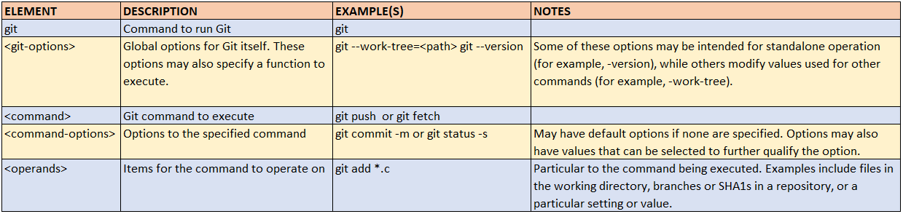

# GIT cheat sheet

## Table of Contents

* [GIT command syntax](#git-command-syntax)
* [GIT help](#git-help)
* [GIT configuration settings](#git-configuration-settings)
* [GIT create](#git-create)
* [GIT Add, Delete, Track changes](#git-add-delete-track-changes)
* [GIT diff files](#git-diff-files)
* [GIT visual diff files](#git-visual-diff-files)
* [Find out History of snapshots](#find-out-history-of-snapshots)
* [GIT Tags](#git-tags)
* [GIT Branches](#git-branches)

   

## GIT command syntax
 

**git {git-options} {command} {command-options} {operands}**
 

 

	
 
	 

   

 
## GIT help 
 
 
**git help -a**  
Display all available Git commands																		
   

**git help -g**  
Display all available Git guides
   																	

**git help glossary**  
Display the Git glossary																	
   

**git {command}  -h**   
Display all options of {command} in Bash																		
Example:  git config -h 
   
 

 
## GIT configuration settings
 

**git config --global user.name "Your Name"**  
Add your name to the global Git configuration                             														
  

	
**git config --global user.email "Your E-mail Address"**  
Add your email address to the global Git configuration																		
  

**git config --global core.editor "'C:\Program Files\Notepad++\notepad++.exe' -multiInst -noSession -notabbar"**  				
Configure GIT to use Notepad++ for edit 
  

**git config --global difftool.bc3.path "C:\Program Files\Beyond Compare 4\BCompare.exe"**   
To configure difftool path     									 
  

**git config --global diff.tool bc3**    
Tell to GIT to use bc3 as difftool for files comparison																							
  

**git config --global difftool.prompt false**   
Tell to GIT don't prompt {yes or no} for each file comparison
  

																					
**git config --list**  																
Display all the Git configurations
  

**git config user.name**	 														
Display the user.name configuration value
  

**git config user.email**		 													
Display the user.email configuration value
  
 
 
## GIT create
 

**git clone** https://github.com/rk-ramakrishna/git_learnings.git   
clone an existing remote repository
  

**git init**  
Create a new local repository
  

## GIT Add, Delete, Track changes
 

**git add {FILE}**  
Start tracking {FILE} in Git; adds FILE to the staging area
  

**git add -f**  
pick part of your changes to add to staging area
  

**git add .** 					 													
To Add all changes in current & sub directory to staging area
  

**git rm --cached file** 			 												
Remove file from staging area. Note: Removed file still available  in working directory
  

**git rename file1 file2**			 
Rename file1 to file2 in the staging area
  

**git status**						 												
Display status of current working directory, as it relates to Git
  

**git status -s** 							 										
Display status of files in short notation form. Short form notations are:  **?? - untracked  A - ADD   M - Modified**
  

**Note**

1. **Tracked files:**   
   Files which are known by GIT, means atleast it maintains single version of file 
     
   
2. **Untracked  files:**   
   Files which are unknown to GIT, means no version of file exist in GIT
     

3. GIT status command displays the tracked & untracked files
	  

**git status -b**   
Displays number of commits which are ahead of Head
  																				

**git commit -m "commit message"**					 								
Commit changes to GIT repository with supplied log message   

**Note:**   
If you would like to provide more meaningful commit message, use git editor. 
  

**git commit -i <name of the file> -m "commit message"**  
Commit only selected files
  

**git commit -am "commit message"**  
Perform git add and then a git commit with supplied log message  

**Note:**   
Above command only works for files which are already tracked by GIT. Above command would not work for files which are newly added in working directory and not staged.
   

**git commit --amend -m "commit message"**     
Update the last commit in git repository with whatever content currently available  in staging area.   
If no updates available  in staging area, then only the commit message updated.

 

**Note:**  
It is not recommended to amend content that has already been pushed to a remote repository where others may be working with it. Operations that rewrite history such as amend 
ideally only be done in your local environment before content is initially pushed to the remote repository.
  

 
## GIT diff files
 

**git diff**   
Show any changes between the tracked files in the current directory and the local repository
  

**git diff –staged**  
Show any changes between the staging area and the repository
  

**Note:**

Git diff is a bit tricky. Comparison of files typically  based on below work flow  

1. Git starts comparing file xxxx in working directory with file xxxx in staging area.  
   If file xxxx not exist in staging area, then it compares xxxx file available  in local repository.   
   
2. If user wants to compar file xxxx in staging area with xxxx in local repository, user should use command **git diff --staged xxxx**     
   Please make a note that, different versions of files in different levels. so while using diff command, you have to understand files and their levels.   

**git diff c344553  w3232323**  
Shows difference between two commits     

**git diff c344553  w3232323 build.gradle**   
Shows difference between the file build.gradle of provided two snapshots    

**git diff c344553 HEAD**   
Shows differences between snapshots c344553 and HEAD    

**git diff c344553 master**  
Shows differences between snapshots c344553 and latest commit in master         

**git diff --name-only**	   														
Shows only names of the files that are different               

**git diff --name-status**      
Shows only names of the files that are different along with status    

## GIT visual diff files
 

* git diff shows the differences in default format called **patch format.** 

* While you are focusing primarily command line usage,there are times when a visual interface adds significant value or convenience.  
  One of these cases is diffing.  To invoke the diffing tool, you run the command **git difftool**.   

* Git comes preconfigured to be able to work with a number of different tools for diffing. 

* To see a list of these tools, you can run the command **git difftool --tool-help**.  

**Note:**  

Use below commands to configure Beyond compare is default compare tool    

**git config --global difftool.bc3.path "C:\Program Files\Beyond Compare 4\BCompare.exe"**     	  								
To configure difftool path        

**git config --global diff.tool bc3**              
Tell to GIT to use bc3 as difftool for files comparison          

## Find out History of snapshots
 

**git log**    
Display the log (history) of the Git repository     

**git log --stat**    
shows some statistics on the number of changes (the number of inserted lines, deleted lines, and so on)      

**git log --stat --oneline**  
Display the log with statistical  information in one line   

**git log --parents**    
Display each log and associated parent log 			    				

**git log --oneline src/main/resources/application.yml**      
Display log of provided file name		            

**git log -n 3**            
Display logs of last 3 commits                  

**git log --oneline --decorate --graph --all**    
Display logs in graphically way         

**git rev-parse HEAD**            
Display the last commit of HEAD        

**git rev-parse <<branch-name>>**			 										
Display the last commit in branch				  

**Note:** git rev-parse and git show has lot of functionality like git log		  	

**git log -4 --oneline --name-only**    
Displays last 4 snapshots file names with information in single line     	

**git log --since 30.12.2019 --until 01.01.2020**             	

**git log --before 01.01.2020 --after 12.31.2019**            	

**gitk**         
Display history visually. GIT log viewer			   	

**git show --name--only 45893EQQ**      	
Display history visually. GIT log viewer			   												

**git ls-files**             		 
List the files in the repository             

# GIT Tags

 

* Tag provides meaningful name to specific commit. For example, if you wanted to refer to a commit as 2.0x,use command: git tag 2.0x <SHA1 value>

* GIT provides two types of Tags
    * Light weight tags
    * Annotated tags 

* A lightweight tag is very much like a branch that doesn’t change. It’s just a pointer to a specific commit. Light weight tags are temporary tags
* Annotated tags contains all objects information like author, commit message etc. It is generally recommended to create & use the Annotated tags rather than light weight tags.   
  **Note:**    
  * The difference between Annotation tags and lightweight tags is for Annotation tags separate commit id created. 
  * But commit id of Annotation tag will not be shown in remote GIT. This is little strange
  * For lightweight tags GIT will not create any separate commit id  
  
   

**git tag -a v2.4x -m "Tagging the changes of 2.4x"**  
Creates new annotation type of tag with name "v2.4x"      

**git tag v2.5x**   																	
creates new light weight type of tag with name "v2.5x"    

**git tag v2.5x v2.6x**  
Rename lightweight tag v2.5x to v2.6x in local repository    

**Note:** 
  * If tag v2.5x already exists in remote repository, then it is required to delete old tag v2.5x and push new tag v2.6x to remote repository
  * git tag -d v2.5x  
  * git push origin --delete v2.5x
  * git push origin v2.6x
  * Inform to other team members to refer newly created tag v2.6x  by executing the git command  **git pull --prune --tags**

**git tag -a v3.4x v2.4x^{}**  
Rename annotation tag v2.4x to v3.4x      

**Note:**
  * Note the syntax ^{} at the end of the command. For annotation tag this syntax is required. 
  * ^{} syntax enables to refer underlying commit[snapshot where old tag was created] instead of referring the old tag commit
  * Refer this thread to get more details https://stackoverflow.com/questions/49283734/why-isnt-my-tag-listed-when-i-checkout-with-git-gui/49286861#49286861  
  		 

**git tag -d <tag-name>**    															
To delete the tag in local repository     

**git tag --list**    														
List out all tags available  in repository      

**git show-ref --tags**  
List out tags along with commit id     

**git show v2.4x**   
Display the tag information      

**git push origin <tag-name>**  
To push the newly created tag available in local repository to remote repository      

**git push --tags**      																
To push all newly created tags in local repository to remote repository     

**git push origin :refs/tags/<tag-name> or git push origin --delete <tag-name>**  
To delete the remote repository tag     														

**git fetch --prune origin "+refs/tags/*:refs/tags/*"**    
Remove tags in local repository which are non-existent in remote repository     

# GIT Branches

	* GIT branches referred as local branch and remote branch. Local branches available in Local repository where as remote branches available in remote repository.     
	* Provision of a new Branch in GIT very fast and light weight. This is just creation of identifier(branch name) with HEAD pointer
	* GIT is more famous, because Branch management is GIT extremely fast compared to other SCM's like CVS and SVN
	* As branch management in GIT is fast & lightweight, Developers are encouraged to create and delete branches in their day to day work as needed 
	* Below are types of GIT branches
	    * Topic Branches
		* Feature Branches
		* Release Branches 
	* Topic branches meant for experimental and exploratory
    * Generally Topic branches are short lived. There is no strict control mechanism required to maintain Topic branches 
    * Quality gates to Topic branches are loosened
	* Feature branches created for new features of product
	* Feature branches code are merged into mainstream branch at some point of time in down the line
	* Feature branches are short lived. Strict control mechanism and oversight required for feature branches as like mainstream branches
	* Quality gates of Feature branches are like mainstream branches 
	* Difference between Feature & Topic branches are Feature branches meant to add new features to existing product, where as Topic branches purpose is for experimental and
      exploratory 
	* Release branch code is final code of product 
	* Very strict control mechanism required to merge or add code changes to Release branch 
	* Matured Quality gates maintained for Release branches
	
	
	
**git branch {branch-name}**    															
Provision of new branch from HEAD   	

**git checkout {branch-name}**    															
checkout newly created branch to working directory   

**git checkout -b {branch-name}**   
Provision new branch from HEAD and checkout to working directory. This command is combination of above two commands    

**git checkout {branch-name}**   
Switch to branch {branch-name} from currently pointed out branch     

**Note:**   
   *  when switch from one branch to other branch GIT performs below activities
   *  your working directory updated with code base of checked out branch 
   *  HEAD updated to refer commit id of checked out branch     

**git branch -m feature/RAPT-446 feature/RAPT-446-Handling of Logout**   
Rename local branch from feature/RAPT-446 to feature/RAPT-446-Handling of Logout   

**Note:**  
   * To reflect the rename of branch in remote repository, follow below steps 
   * Delete old branch in local repository   **git branch -d feature/RAPT-446**
   * Delete old branch in remote repository   **git push origin --delete feature/RAPT-446**
   * Push newly created branch in remote repository   **git push origin feature/RAPT-446-Handling of Logout**     
   
**git branch -d <branch-name>**					 
To delete the branch in local repository           

**git branch --list**  					 
Display list of branches available with local repository     

**git branch --all**        		 
Display the list of branches of local & remote repository                

**git branch --v**        		 
Display list of branches verbose information               

**git push origin <branch-name>**           
Command to push newly created local branch to remote repository         

**git push origin --delete <branch-name>**   
To delete branch in remote repository      

   
   
	